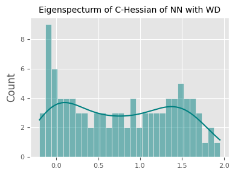
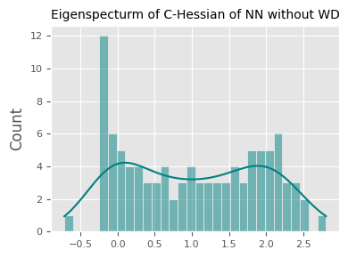

# hands_on_jax
Simple codes for JAX in practice

## 0. JAX as numpy with auto-differentiation

* Linearization of function
  
  

## 1. Construct Neural Networks with Haiku

* Visualizing MLP structure
  
  

## 2. Stochastic Models

* Monte-Carlo DropOut (MCDO)
  
  

## 3. Image Classification

* Learning rate scheduling
  
  

## 4. Loss landscape

* Visualizing loss landscape with filter normalization
  
  | Visualization method | with weight decay | without weight decay |
  |:---:|:---:|:---:|
  | Filter Normalization |  |  |
  | Random vector |  |  |

* Eigenspectrum of Hessian with stochastic Lanczos iteration

  | Eigenspectrum | with weight decay | without weight decay |
  |:---:|:---:|:---:|
  | [Connectivitiy Hessian](https://arxiv.org/abs/2209.15208) |  |  |
  | Hessian |  |  |